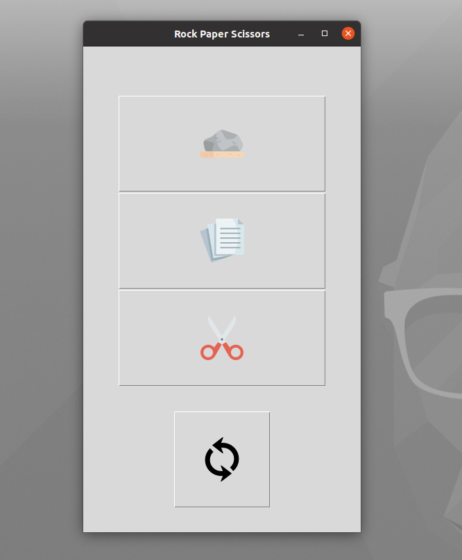

# Tkinter 

Tkinter is a Python GUI framework

## About rps.py
Rock paper and scissor game using Tkinter

Rock paper scissor is a hand game usually played between two people, 
in which each player simultaneously forms one of three shapes with an outstretched hand. 
These shapes are “rock”, “paper”, and “scissors”.

Game Winner Condition:

Paper and Scissor =>Scissor win
Rock and Scissor =>Rock win
Paper and Rock =>Paper win

Below is what the GUI looks like:

## Screenshot

